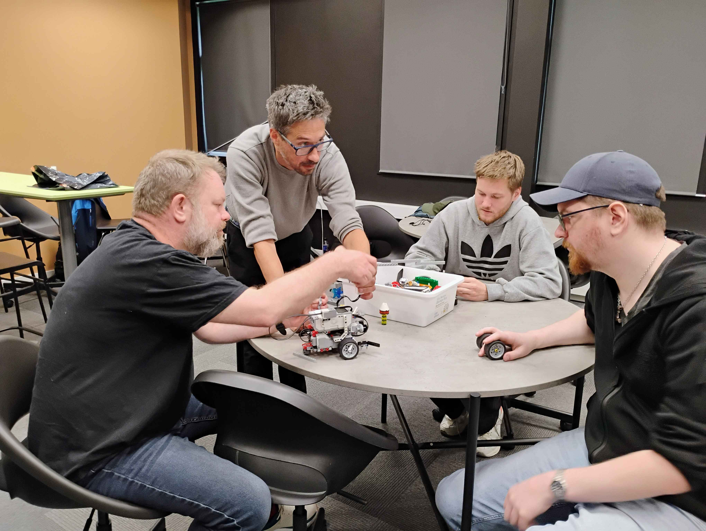
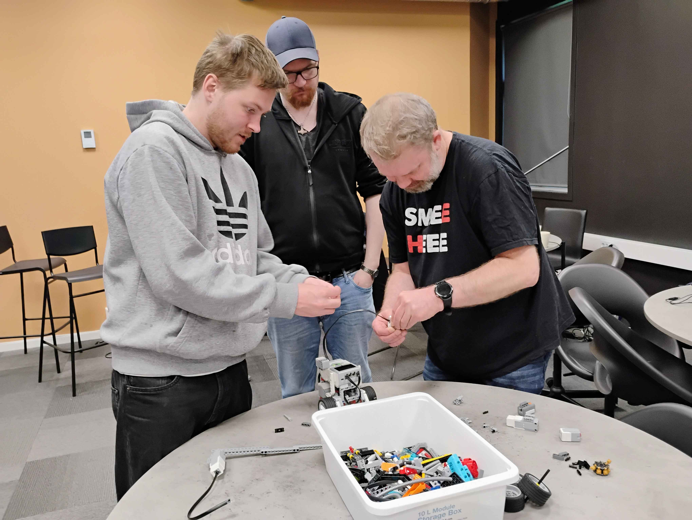
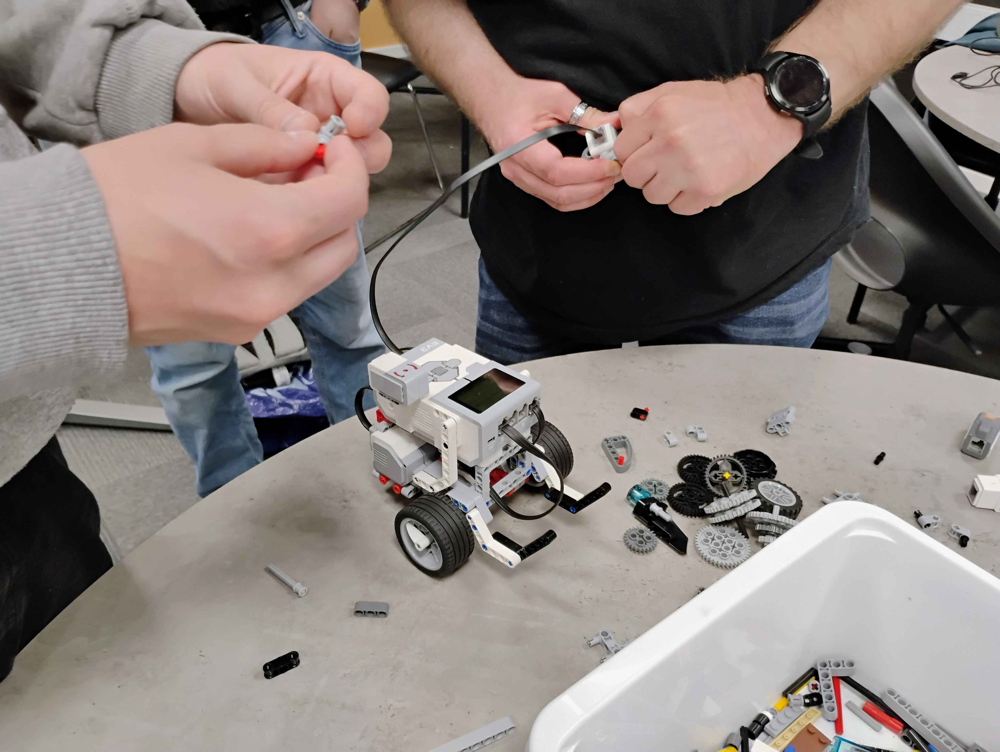
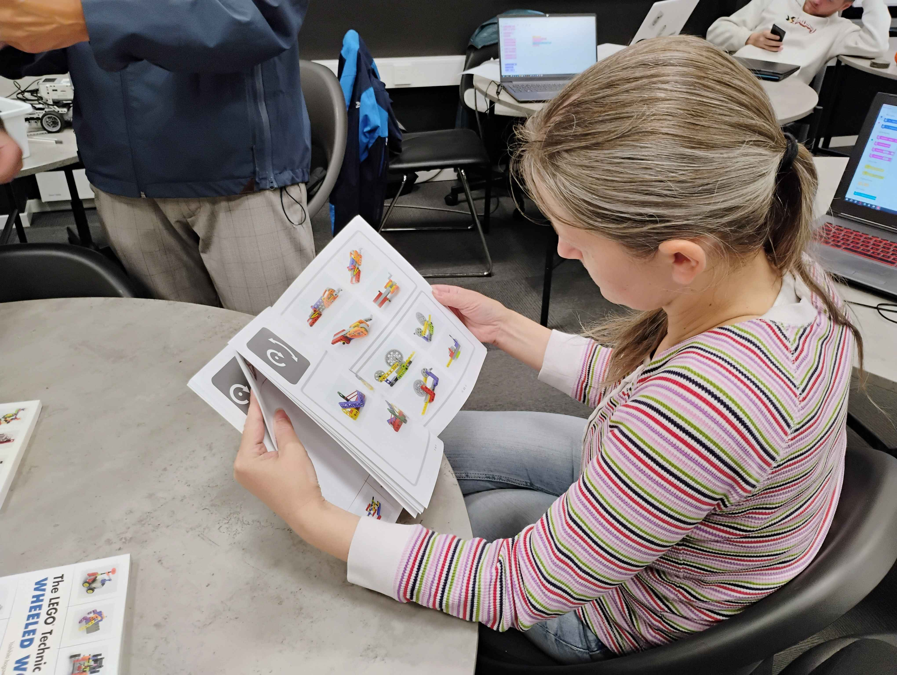
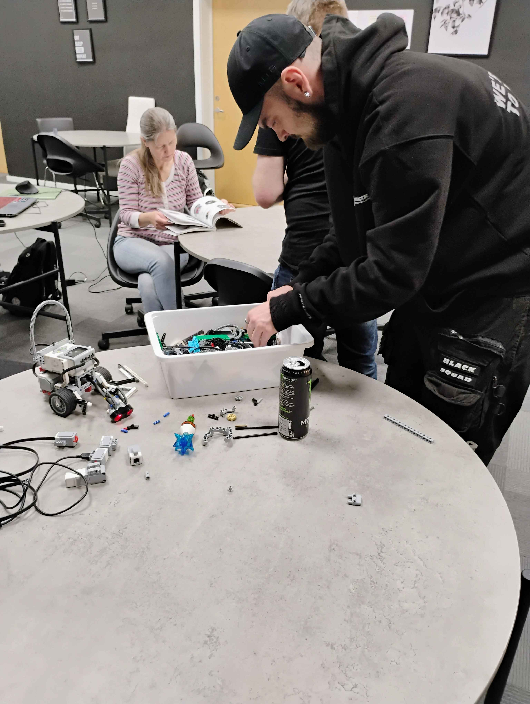
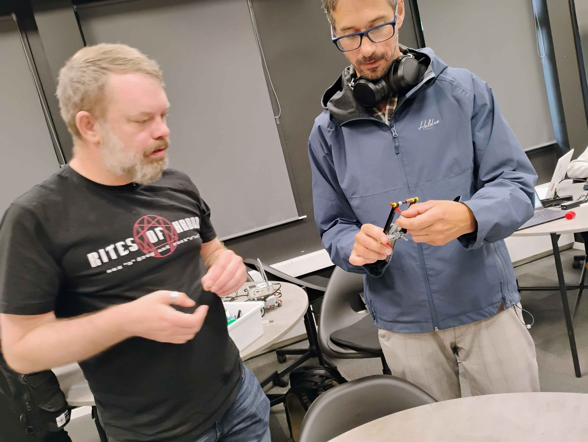
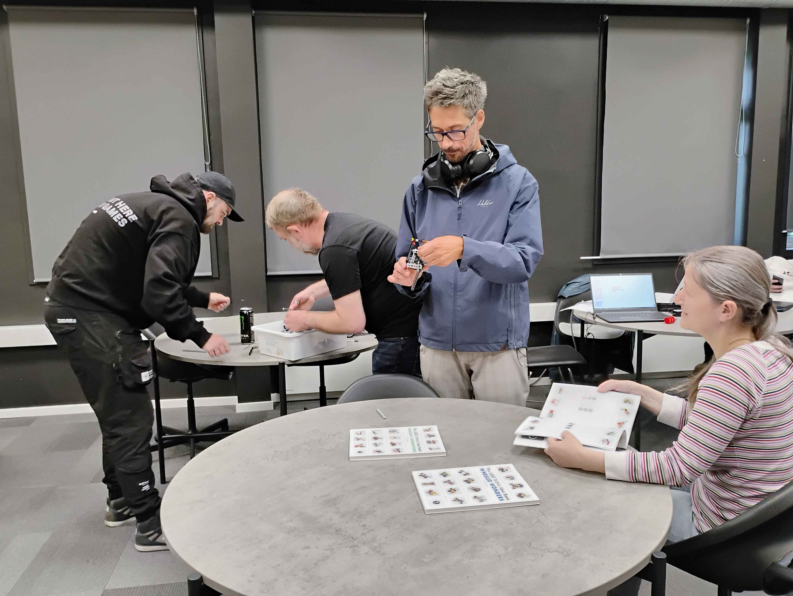

<h1>Here we are experimenting with EV3 Classroom App</h1>

<h2>Copyrights belong to:</h2>

LEGO, the LEGO logo, the Minifigure, DUPLO, the SPIKE logo, MINDSTORMS and the MINDSTORMS logo are trademarks and/or copyrights of the LEGO Group. ©2024 The LEGO Group. All rights reserved

<h3>Contributers</h3>

[Jesper](https://github.com/JesperKoder) 
[Erik](https://github.com/NordikE) 
[Trond-Morten](https://github.com/TrondMortenR) 
[André](https://github.com/AndreK-B06) 
[Virad](https://github.com/VidarHeritier) 
[Sebastian](https://github.com/Sebahoppkodehode) 
[Inna](https://github.com/Inna-B10) 

<h4>18.06.24</h4>
<ol>
  <li>Made spinning top to test motors</li>
  <li>Tested light sensor (positioning wasn't ideal)</li>
  <li>Construction over controller for arm for actions</li>
  <li>Funnel construction at front to position rover</li>
  <li>Light sensor removed</li>
  <li>Pressure sensor tested. Positioning is an issue</li>
  <li>Ultra-sound sensor tested. Several positions tested. On top of controller is possibly best</li>
  <li>Ultra-sound sensor moved to top</li>
  <li>Lifting arm moved to front</li>
</ol>

<h5>Map:</h5>
  
  

<h4>FIGMA teknisk tegning: https://www.figma.com/design/gI44lyrQWq6s6Zsy5UHBL8/Lego-EV3-prosjekt?node-id=0-1&t=CTpBxnVSGvdyB3AW-1 </h4>

<h5>Day: 1</h5>  

  
  
  
  
  

 

<h5>Day: 2</h5>

  
  
  
  

